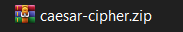

# Caesar-Cipher-Algorithm
A Caesar Cipher encryption and decryption tool

  [](https://badges.pufler.dev)

# Usage
NOTE: You must have python installed on your pc to be able to use this tool.
- <a href="https://realpython.com/installing-python/">_Guide_</a> to install and setup python

## On Windows PC
- Download the <a href="https://github.com/HybridCodes/Caesar-Cipher-Algorithm/releases/latest">_file_</a>
- Locate the `.zip` file
  
   
- Right-click on the file and click `Extract to "caesar_cipher"`
  - In this case, i'm using <a href="https://www.win-rar.com/start.html?&L=0">_winrar_</a> to extract the file
- Open command prompt and navigate to the folder in which you extracted the file
```bash
# Command Prompt

# Hit enter after typing each command to execute the command

C:\Users\your_name>cd Downloads # To navigate to the Downloads folder

C:\Users\your_name\Downloads>dir # To see the items in the Downloads folder
caesar_cipher

C:\Users\your_name\Downloads>cd caesar_cipher

C:\Users\your_name\Downloads\caesar_cipher>py caesar_cipher.py
```

## On Android
- Download <a href="https://play.google.com/store/apps/details?id=com.termux&hl=en_US&gl=US">_Termux_</a> from the play store
- Open Termux and execute the following commands:
```bash
# Hit enter after typing each command to execute the command

$ pkg update && upgrade / -y
$ pkg install python
$ pkg install pip 
$ pkg install git
$ pip install --upgrade pip
$ pip install colorama
$ termux-setup-storage # Allow access to storage
$ cd storage
$ dir # Execute this command to see the list of items in the directory you're currently in
  # In my case, the output is:
  dcim       external-1  music    shared
  downloads  movies      pictures
$ cd downloads # To navigate to the downloads folder
$ git clone https://github.com/codebytesz/Caesar-Cipher-Algorithm.git
$ dir # You should see the cloned item among the files listed
  Caesar-Cipher-Algorithm
$ cd Caesar-Cipher-Algorithm
$ dir # (Optional) To see the items in the Caesar-Cipher-Algorithm folder
$ python caesar_cipher.py # This command starts the program
```
**Alternatively:**
- Download <a href="https://play.google.com/store/apps/details?id=com.termux&hl=en_US&gl=US">_Termux_</a> from the play store
- Download the zip <a href="https://github.com/HybridCodes/Caesar-Cipher-Algorithm/releases/latest">_file_</a> and extract it into a folder
- Open Termux and execute the following commands:
```bash
# Hit enter after typing each command to execute the command

$ pkg update && upgrade / -y
$ pkg install python
$ pip install colorama
$ termux-setup-storage # Allow access to storage
$ cd storage
$ dir # (Optional) This command is to see the list of items in the directory you're currently in
```
- Navigate to the folder in which you extracted the file
  - Mine is in `downloads`
```bash
$ cd downloads
$ dir
  #output
  Caesar-Cipher-Algorithm
$ cd Caesar-Cipher-Algorithm
$ dir # (Optional) To see the items in the Caesar-Cipher-Algorithm folder
$ python caesar_cipher.py # This command starts the program
```

# Report a bug :beetle:
If you experience any bugs or want to make a contribution, create an <a href="https://github.com/codebytesz/Caesar-Cipher-Algorithm/issues">_issue_</a>.